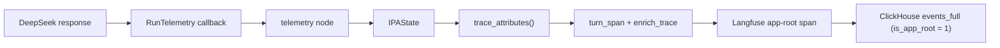

# Production Dashboards — Langfuse Observability

This runbook shows how to build and read the production dashboards on the
self-hosted Langfuse v4 UI so that operational questions can be answered by
looking at a dashboard instead of digging through logs.

Companion file: [`queries.sql`](./queries.sql) — ClickHouse ground-truth
queries. Every dashboard below is a UI recipe; the matching ground-truth query
lets you prove the panel number is right.

## 1. Prerequisites

- The app is running against the production stack (Postgres checkpointer, the
  observability profile is up). The run's trace identity is stamped by the
  invoke site AFTER the graph returns, so nothing here depends on the graph's
  node order.
- Each run's trace carries `schema_version = "2.1"` metadata, `tags` with
  `env:*`, `channel:*` and `status:*`, the token counters (incl. the flat
  `cache_hit_ratio`), `tool_outcomes` (per-call summary) and the error
  taxonomies. That identity is written onto the run's own **app-root span** —
  the only row Langfuse reads a trace's name/tags/metadata from. Confirm once:
  1. Run a single assistant turn with tools.
  2. Open the trace in **Project → Traces**; it is named `assistant:<route>`
     (e.g. `assistant:knowledge`).
  3. In **Trace details → Metadata**, verify `schema_version = "2.1"` and the
     keys above. In the trace **Tags**, verify `status:tool_ok` (or
     `status:tool_error`) plus `env:prod` and `channel:*`.
- Ground truth lives in the **`default.events_full`** ClickHouse table, NOT in
  the legacy `traces` / `observations` tables (empty on Langfuse 4.30). Trace
  level fields exist only on the app-root row, so the matching queries filter
  `is_app_root = 1`; run the `queries.sql` §0 probes first if one returns
  nothing.
- A run that never finished (crash, timeout, abandoned socket) keeps the fallback
  trace name `assistant:turn`: it still carries `env:*` / `channel:*` but has no
  `status:*` tag and no route metadata. `assistant:turn` rows in the routing
  distribution are therefore a signal worth reading, not a bug.
- **Cost needs pricing.** The DeepSeek API does not return cost in the
  response, so Langfuse can only infer it from a model definition:
  - **Where:** Project → **Settings → Models** → **+ New model definition**.
  - **Match pattern** is a regex tested against the generation's `model`
    attribute — the value the *app* sends (`settings.deepseek_model_flash`),
    not what the provider bills. `(?i)^(deepseek)` covers every name seen in
    the data (`deepseek-flash`, `deepseek-v4-flash`, `deepseek-v4-pro`). Leave
    the **tokenizer** empty: we ingest real token counts.
  - **Prices are PER TOKEN**, not per 1M — Langfuse stores a price per unit
    (`unit: TOKENS`). Divide the provider's per-1M figure by 10⁶ and add one
    row per usage type that actually arrives in `usage_details` (see Q9). The
    key names must match **exactly**:

    | Usage type | Meaning | DeepSeek flash |
    |---|---|---|
    | `input` | cache **miss** input | $0.30 / 1M → `3e-7` |
    | `input_cache_read` | cache **hit** input | $0.006 / 1M → `6e-9` |
    | `output` | completion tokens | $1.20 / 1M → `1.2e-6` |

  - **Not retroactive.** Inferred cost is computed at ingestion time, so only
    generations logged *after* the definition is saved get cost; existing
    traces stay at $0 forever. Run a fresh turn and re-run Q1b to confirm.
  - **Peak / off-peak is not expressible.** Pricing-tier conditions can match
    usage details, model parameters or metadata — there is no time-of-day
    condition. Enter the **peak** rate (fail-safe: every cost panel then reads
    as an upper bound, and real spend is 0–50% lower), or compute the cost in
    the app and ingest `cost_details`, which takes priority over inference.
  - **Verify** after saving: `GET /api/public/models`, filter for `deepseek`,
    and check `prices.input.price ≈ 3E-07` and that `input_cache_read` is
    present. A value of `0.3` means the per-1M figure was entered as-is.
- Metric names below follow Langfuse v4 wording; §2 maps the documentation terms
  onto the labels the UI actually uses, and the "answerable question" column is
  the source of truth if a name has moved again.

## 2. Where things live in the UI

The split that causes the most confusion: **Project → Dashboards** has a
**Widgets** tab (a library of reusable widget definitions) and a **Dashboards**
tab (layouts that *place* widgets). A dashboard has **no metric or dimension
editor of its own** — you always create or edit a **widget** first, then place
it on one or more dashboards. That is why a freshly created dashboard looks
empty with nowhere to type a metric.

- **Project → Home** — itself a dashboard. The dashboard selector in its header
  chooses which one Home renders (**Set as default** makes it the project's
  Home for everyone).
- **Project → Dashboards → Widgets** — the library. **New widget** opens a page
  titled **New Widget** holding the form described in §3.
- **Project → Dashboards → <name>** — the layout. **Add widget** places a
  library widget on it; tiles drag and resize.
- **Project → Traces / Generations / Users / Sessions** — the raw lists behind
  every panel, for drilling into a spike.

### The labels do not match the documentation

| Documentation / schema term | Label in the v4 UI | Notes |
|---|---|---|
| Data source | **View** | Observations or Scores (numeric / boolean / categorical). **`Traces` is not offered for new widgets** — see the box below. |
| Metrics | **Metric** (singular) | **"Metrics"** (plural) appears only when Chart Type is **Pivot Table**, the one type that accepts several measures. |
| Dimensions | **Breakdown** | The JSON field is `dimensions`; the UI never says "Dimensions". A `None` option means "no grouping". |
| Chart kind | **Chart Type** | Grouped into *Time Series* / *Total Value*; **Pivot Table** is the multi-metric, multi-dimension outlier. |
| Conditions | **Filters** | Same `column / type / operator / value` shape as the widget JSON (§3), with a **Presets** popover. |

Two further traps:

- **The Breakdown control is hidden** for chart types that do not support a
  breakdown. Pick *Line Chart* or *Big Number* and there is no breakdown field
  at all — switch to a bar, pie or pivot chart to see it.
- **The environment is a dashboard-level selector, not a widget field**, and a
  widget-level environment filter *overrides* it for that widget only. This
  instance holds `prod`, `dev` **and** `default` rows, so a dashboard with the
  selector left on "All" mixes environments and its numbers will not match the
  ground-truth queries referenced per widget in §5.

## 3. The widget model — exact fields and allowed values

Every widget is one object, and the form fields in §4 are just a UI over it.
Export any tile with **⋯ → Download as JSON** to see your own:

```json
{
  "name": "Cost per day",
  "description": "",
  "view": "observations",
  "dimensions": [{ "field": "providedModelName" }],
  "metrics":    [{ "measure": "totalCost", "agg": "sum" }],
  "filters":    [{ "column": "type", "type": "string", "operator": "=", "value": "GENERATION" }],
  "chartType": "VERTICAL_BAR",
  "chartConfig": { "type": "VERTICAL_BAR", "row_limit": 25 }
}
```

| Field | Allowed values |
|---|---|
| `view` | `observations`, `scores-numeric`, `scores-boolean`, `scores-categorical` |
| `metrics[].measure` | `count`, `latency`, `totalCost`, `totalTokens`, `toolCallInvocations`, `timeToFirstToken`, `usageByType`, `costByType` |
| `metrics[].agg` | `count`, `sum`, `avg`, `p50`, `p95`, `histogram` — the list is filtered by the measure's type |
| `dimensions[].field` | `providedModelName` (Model), `name`, `traceName`, `environment`, `type`, `level`, `tags`, `usageType`, `costType`, `userId`, `sessionId` |
| `chartType` | `NUMBER`, `LINE_TIME_SERIES`, `BAR_TIME_SERIES`, `VERTICAL_BAR`, `HORIZONTAL_BAR`, `HISTOGRAM`, `PIE`, `PIVOT_TABLE` |
| `chartConfig` | `{ type, row_limit (1–1000), bins (1–100), show_value_labels, defaultSort: { column, order } }` |

Filter objects (all four forms used by the widgets in §5):

```json
{ "column": "isRootObservation", "type": "boolean",      "operator": "=",      "value": true }
{ "column": "type",              "type": "string",       "operator": "=",      "value": "GENERATION" }
{ "column": "level",             "type": "string",       "operator": "=",      "value": "ERROR" }
{ "column": "tags",              "type": "arrayOptions", "operator": "any of", "value": ["status:tool_error"] }
```

Four rules the **Save** button enforces (all are Langfuse v4 changes):

1. **Exactly one metric** on every chart type except `PIVOT_TABLE` — which is
   why p50 and p95 need two widgets instead of one two-line chart.
2. **At most one dimension** on every chart type except `PIVOT_TABLE`.
3. **High-cardinality dimensions** (`userId`, `sessionId`, …) require both a
   `row_limit` and a `defaultSort`, and cannot be used on a time-series chart.
4. `id`, `traceId`, `parentObservationId` and `isRootObservation` are
   **filter-only** — they are never offered as dimensions.

> **The `traces` view is gone for new widgets.** v4 removed it (it forced a
> costly per-trace aggregation); a widget still targeting it falls back to v3
> definitions. The v4 replacement for a *trace-level count* is
> `view: observations` **+ filter `isRootObservation = true`** — the app-owned
> root span, i.e. one row per assistant turn.

## 4. Build a widget — step by step

### 4.1 In the UI

1. **Project → Dashboards** → the **Widgets** tab → **New widget**. The page is
   titled **New Widget**.
2. Leave the name blank for now — Langfuse auto-suggests one from your
   selections and you can overwrite it before saving.
3. **View** → `Observations`. Pick this first: metrics and dimensions are
   per-view, so the *Metric* list is populated only once a view is chosen.
4. **Metric** → the measure (e.g. *Total Cost*) **and** the aggregation
   (e.g. *Sum*). For *Count* the aggregation is fixed.
5. **Breakdown** → the grouping dimension, or leave **None**. If the control is
   missing, the chart type does not support a breakdown — change Chart Type.
6. **Filters** → one row per condition, in the `column / type / operator /
   value` shape from §3.
7. **Chart Type** → *Line Chart* for a metric over time, *Vertical Bar Chart*
   to compare categories, *Big Number* for one value.
8. Watch the live preview, then **Save**. The widget is saved to the
   **library** — not to a dashboard yet.
9. **Project → Dashboards → <the dashboard>** → **Add widget** → pick it from
   the library → arrange by dragging and resizing.
10. On the dashboard, set the **environment selector** (`prod`) and the date
    range. Both live on the dashboard, not in the widget.

### 4.2 The same object via the API

Repeatable and scriptable — useful when rebuilding on the DeskMini. This is how
widget 1a in §5 was created:

```powershell
$c = @{}
Get-Content backend/.env.prod | Where-Object { $_ -match '^\s*LANGFUSE_(PUBLIC_KEY|SECRET_KEY)\s*=' } | ForEach-Object { $k,$v = $_ -split '=',2; $c[$k.Trim()] = $v.Trim() }
$h = @{ Authorization = "Basic $([Convert]::ToBase64String([Text.Encoding]::ASCII.GetBytes("$($c['LANGFUSE_PUBLIC_KEY']):$($c['LANGFUSE_SECRET_KEY'])")))" }

$body = @{
  name = 'Cost per day'; description = ''; view = 'observations'; dimensions = @()
  metrics = @(@{ measure = 'totalCost'; agg = 'sum' })
  filters = @(@{ column = 'type'; type = 'string'; operator = '='; value = 'GENERATION' })
  chartType = 'LINE_TIME_SERIES'; chartConfig = @{ type = 'LINE_TIME_SERIES' }
} | ConvertTo-Json -Depth 6

Invoke-RestMethod -Uri 'http://127.0.0.1:3000/api/public/unstable/dashboard-widgets' `
  -Method Post -Headers $h -ContentType 'application/json' -Body $body
```

`GET` the same path to list what exists. These endpoints are flagged
**unstable** upstream, so if a call stops working, trust the UI form.

### 4.3 Moving widgets between instances

**⋯ → Download as JSON** on a widget exports
`{"$langfuseWidget": true, "version": 1, ...}`; a dashboard exports the matching
`{"$langfuseDashboard": true, "version": 1, ...}` envelope with its widgets
inlined. **Drag the file onto a dashboard to import it** — Langfuse validates it
and recreates the widgets. That is the supported way to reproduce a dashboard on
a second instance without re-clicking every field.

## 5. Widget-by-widget specification

Build each widget in the **Widgets** library (§4), then place it on a dashboard.
Provenance (§6) says where the number physically comes from; "ground truth" is
the query in [`queries.sql`](./queries.sql) the panel must agree with.

| # | Widget | View | Metric | Breakdown | Filters | Chart | Ground truth |
|---|---|---|---|---|---|---|---|
| 1a | Cost per day | observations | `totalCost` / `sum` | — | `type = GENERATION` | Line | Q1 |
| 1b | Cost by model | observations | `totalCost` / `sum` | `providedModelName` | `type = GENERATION` | Vertical bar | Q1b |
| 2a | Latency p50 | observations | `latency` / `p50` | — | `type = GENERATION` | Line | Q2 |
| 2b | Latency p95 | observations | `latency` / `p95` | — | `type = GENERATION` | Line | Q2 |
| 3 | Routing distribution | observations | `count` / `count` | `traceName` | `isRootObservation = true` | Horizontal bar | Q4 |
| 4a | Tool errors per day | observations | `count` / `count` | — | `isRootObservation = true` + tag `status:tool_error` | Line | Q5, Q6 |
| 4b | Runs with tools OK | observations | `count` / `count` | — | `isRootObservation = true` + tag `status:tool_ok` | Line | Q5 |
| 5 | Cache tokens by usage type | observations | `usageByType` / `sum` | `usageType` | `type = GENERATION` | Vertical bar | Q9, Q10 |
| 6 | Permission denials | observations | `count` / `count` | — | `isRootObservation = true` + tag `status:permission_denied` | Line | Q7 |
| 7a | LLM errors per day | observations | `count` / `count` | — | `level = ERROR` | Line | Q8b |
| 7b | Tool errors by day | observations | `count` / `count` | — | `isRootObservation = true` + tag `status:tool_error` | Line | Q5 |

Useful starting points: the Langfuse-curated **Cost**, **Latency** and **Usage**
dashboards are managed, and editing one duplicates it into your project —
often faster than building from scratch.

> **Two identifiers to confirm on the first build.** The dimension and filter
> names here are taken from the v4 widget schema and have been validated through
> the widgets API, but two have not yet been eyeballed in this instance's form:
> the trace-level name dimension (expected `traceName`) and the tags filter
> operator label (expected `any of`). If either differs, correct this table —
> everything else is copied straight from the JSON the form saves.

### 5.1 Dashboard "Cost per day" (widgets 1a, 1b)

Answers: how much did I spend today / this week, and on which model?

| Field | 1a Cost per day | 1b Cost by model |
|---|---|---|
| View | Observations | Observations |
| Metric | `totalCost` / `sum` | `totalCost` / `sum` |
| Breakdown | None — a line chart is already over time | `providedModelName` (label *Model*) |
| Filters | `type` `string` `=` `GENERATION` | same |
| Chart Type | Line Chart | Vertical Bar Chart (`row_limit` ~25) |

**Provenance:** DeepSeek returns no cost, so `totalCost` is **inferred** — the
model definition's per-token prices (§1) multiplied by the generation's
`usage_details`. A flat $0 panel therefore means "no definition matched", not
"no usage".

**Gotchas:** cost is computed at ingestion, so newly added pricing never
reprices old traces — expect a step change on the day you configured it. And
set the dashboard's environment selector to `prod`, or the pre-fix `dev` and
`default` rows appear in the same line.

### 5.2 Dashboard "Latency" (widgets 2a, 2b)

Two widgets, not one: a non-pivot chart accepts **exactly one metric**, so p50
and p95 cannot share a chart unless you use a Pivot Table.

| Field | Value (both widgets) |
|---|---|
| View | Observations |
| Metric | `latency` / `p50` (2a) and `latency` / `p95` (2b) |
| Breakdown | None |
| Filters | `type` `string` `=` `GENERATION` |
| Chart Type | Line Chart |

**Provenance:** `latency` is the duration of the *generation* — one model call,
taken from its span's start/end timestamps. It is not the whole assistant turn.

**Gotchas:** on v4 there is no trace-level latency tile (the traces view was
removed), so a genuine whole-turn duration has no direct metric; use p95 of the
longest generation as the proxy and cross-check against Q2 and Q3. Read p95, not
p50 — personal usage is bursty and the tail is where ReAct loops and cold caches
show up.

### 5.3 Dashboard "Routing distribution" (widget 3)

Answers: which intents did users hit this week?

| Field | Value |
|---|---|
| View | Observations |
| Metric | `count` / `count` |
| Breakdown | `traceName` |
| Filters | `isRootObservation` `boolean` `=` `true` |
| Chart Type | Horizontal Bar Chart, `row_limit` 20, `defaultSort` on the count (DESC) |

**Provenance:** the app stamps the trace name at invoke time as
`langfuse_trace_name` (`assistant:turn`), and `enrich_trace` refines it to
`assistant:<route>` once the run finishes — so `assistant:turn` rows are runs
that *never completed* (crash, timeout, abandoned socket). The
`isRootObservation = true` filter is what makes this a **per-run** count: it
selects the app-owned root span, our `turn_span()`.

**Gotchas:** without the root filter this counts every span in every run and the
total is meaningless. A new, unexpected `assistant:<route>` value is itself a
signal. Ground truth Q4.

### 5.4 Dashboard "Tool success / failure" (widgets 4a, 4b)

| Field | 4a Tool errors per day | 4b Runs with tools OK |
|---|---|---|
| View | Observations | Observations |
| Metric | `count` / `count` | `count` / `count` |
| Breakdown | None | None |
| Filters | `isRootObservation` `boolean` `=` `true` **+** `tags` `arrayOptions` `any of` `["status:tool_error"]` | same, with `["status:tool_ok"]` |
| Chart Type | Line Chart | Line Chart |

Success rate ≈ 4b ÷ (4a + 4b).

**Provenance:** both tags are written by `trace_attributes()` from the run's
`tool_outcomes`: `status:tool_ok` when at least one tool ran and none raised,
`status:tool_error` when at least one raised, and `status:permission_denied`
when a denial occurred (it wins over the other two). Per-call detail is in the
`tool_outcomes` metadata key, a comma-separated
`<tool>:<ok|denied|error_type>:<duration_ms>` list — e.g.
`calculate:ok:3.3,calculate:ok:4.4`.

**Gotchas:** the calculator returns an error *string* on bad input instead of
raising, so user-input mistakes count as `status:tool_ok` by design — this panel
is about raised errors and unknown tools. Ground truth Q5, Q6.

### 5.5 Dashboard "Prompt cache" (widget 5)

The single widget that shows cached vs fresh prompt tokens, without hunting for
a "cached" metric that does not exist:

| Field | Value |
|---|---|
| View | Observations |
| Metric | `usageByType` / `sum` |
| Breakdown | `usageType` |
| Filters | `type` `string` `=` `GENERATION` |
| Chart Type | Vertical Bar Chart |

**Provenance:** `usageType` / `usageByType` pivot the generation's
`usage_details` map. On this stack the keys are exactly `input`,
`input_cache_read` and `output` (Q9), and they are **mutually exclusive
buckets** — `input` is the cache **miss** count, `input_cache_read` the **hit**
count, and `input + input_cache_read + output = total`. The bar chart therefore
reads directly as fresh vs cached.

**The ratio is not a widget.** A ratio of two buckets is not expressible as one
metric, so read the app-computed `cache_hit_ratio` from a trace's metadata (it
sits next to `cache_hit_tokens` / `cache_miss_tokens`), or compute Q10.

**Gotcha:** cached tokens are cheap but not free — they only contribute to cost
once `input_cache_read` has a price in the model definition (§1).

### 5.6 Dashboard "Permission denials" (widget 6)

| Field | Value |
|---|---|
| View | Observations |
| Metric | `count` / `count` |
| Breakdown | None |
| Filters | `isRootObservation` `boolean` `=` `true` **+** `tags` `arrayOptions` `any of` `["status:permission_denied"]` |
| Chart Type | Line Chart |

**Provenance:** the app tags a run `status:permission_denied` when a tool raises
a denial — a `PermissionError`, a name in the tool layer's deny list, or any
exception carrying a truthy `permission` attribute.

**Where the detail lives:** the per-denial records (`{tool, reason, user_id}`)
are persisted in the run's session state in the `app-db` checkpointer. **No
trace metadata key carries them**, so when the tag fires, read them from
Postgres — this widget is the trigger, not the report.

Expected to stay at zero until authorization ships (a later milestone); the
widget exists so the first real denial needs no code change to become visible.
Ground truth Q7.

### 5.7 Dashboard "Error taxonomy" (widgets 7a, 7b)

| Field | 7a LLM errors per day | 7b Tool errors by day |
|---|---|---|
| View | Observations | Observations |
| Metric | `count` / `count` | `count` / `count` |
| Breakdown | None | None |
| Filters | `level` `string` `=` `ERROR` | `isRootObservation = true` + tag `status:tool_error` |
| Chart Type | Line Chart | Line Chart |

**Provenance — two independent paths by design:**

- `level` is set by the tracing layer: a failed model call records an
  observation with `level = ERROR` and the error text in `status_message`.
- The app *also* buckets failures into flat metadata strings —
  `llm_error_taxonomy` (`rate_limit`, `auth`, `timeout`, or the exception
  class) and `tool_error_taxonomy` — both `name:count`.

**Drill-down:** an ERROR generation shows the provider message; a
`status:tool_error` trace → Metadata shows both taxonomies and the per-call
`tool_outcomes`. Ground truth Q8, Q8b.

## 6. Where each number comes from

Every widget reads one denormalised ClickHouse table, `default.events_full`
(a superset of the legacy `traces` / `observations` tables, which stay **empty**
on 4.30). This maps each panel element to the column and the code that writes
it:

| Panel element | Langfuse field | `events_full` column | Written by |
|---|---|---|---|
| Cost | `totalCost` | `total_cost` | **Inferred by Langfuse**: model-definition price × usage — no cost is ever ingested by the app |
| Token usage per type | `usageByType` | `usage_details[k]` | DeepSeek response → LangChain → Langfuse callback handler |
| Latency | `latency` | `end_time − start_time` | Span timestamps from the tracer |
| Run / trace count | `count` with `isRootObservation = true` | `is_app_root = 1` | The app-owned root span opened by `turn_span()` |
| Trace name | `traceName` | `trace_name` | `langfuse_trace_name` at invoke time, refined to `assistant:<route>` by `enrich_trace()` |
| Tags | `tags` | `tags` | `langfuse_tags`, built by `trace_attributes()` |
| Environment | `environment` | `environment` | Client construction: `environment=settings.env` |
| Model | `providedModelName` | `provided_model_name` | The `model=` the app sends for that tier |
| Level | `level` | `level` | Tracer; `ERROR` on a failed model call |
| Session / user | `sessionId` / `userId` | `session_id` / `user_id` | `langfuse_session_id` / `langfuse_user_id` |
| Trace metadata | trace metadata | `metadata_names` / `metadata_values` | `trace_attributes()`, see below |

The chain for everything in that last row:



`trace_attributes()` (`backend/app/core/observability.py`) is the single place
that turns run state into trace identity. It produces the flat keys
`schema_version`, `route`, `lang`, `channel`, `tool_iterations`, `llm_calls`,
`input_tokens`, `output_tokens`, `cache_hit_tokens`, `cache_miss_tokens`,
`cache_hit_ratio`, `tools_called`, `tool_outcomes`, `tool_error_taxonomy`,
`llm_error_taxonomy`, plus the `env:*` / `channel:*` / `status:*` tags.

Two consequences worth internalising:

- **Trace metadata lives on the app-root row only**, so trace-level panels must
  filter `isRootObservation = true` while observation-level ones (cost, latency,
  tokens) filter `type = GENERATION`.
- **Anything you want to slice a panel by must be added in code** — a new
  metadata key means a change in `trace_attributes()` and a
  `TRACE_SCHEMA_VERSION` bump, never just a dashboard edit.

## 7. Weekly "read the dashboards" routine

Once a week, answer these purely from the dashboards (no log access):

1. **Cost per day** — did spend jump? Which model/day? Did a single turn
   (ReAct loop) blow the budget? (Drill into that day's traces.)
2. **Latency p95** — creeping up? Correlate with cache-hit ratio: if the ratio
   dropped, prompts are cold-caching more (rephrased/rare intents) and calls
   get slower + pricier.
3. **Routing distribution** — any new/unexpected route? Did voice/text usage
   shift?
4. **Tool success/failure** — any tool erroring repeatedly this week? Open one
   trace per bucket to read `tool_error_taxonomy`; fix or file the bug.
5. **Permission denials** — any? (Expected zero until authorization exists.)
6. **Error taxonomy** — are the errors rate limits (provider), timeouts
   (network/setup), or real bugs? Rate-limit clusters suggest adding retry /
   backoff; timeouts suggest the DeskMini or the provider is struggling.

If you cannot answer one of these from the dashboards, add the widget/panel
now — the goal is that a week of real usage makes these one-glance reads.

## 8. Keeping it trustworthy

- Panels and `queries.sql` must agree. Any time you change the shape of trace
  metadata (`schema_version`), re-check the dashboard filters, re-run the
  matching queries AND re-run the `queries.sql` §0 probes; bump
  `TRACE_SCHEMA_VERSION` when you change the metadata shape so old and new
  traces stay distinguishable. The layout to remember: trace fields live on
  the app-root row of `default.events_full` (`is_app_root = 1`), and the
  legacy `traces` / `observations` tables stay empty on Langfuse 4.30.
- Dashboards are configuration stored by Langfuse, not code — back them up by
  backing up the Langfuse Postgres + ClickHouse volumes (see the backup
  runbook; both are already in `backup.conf` as items).
